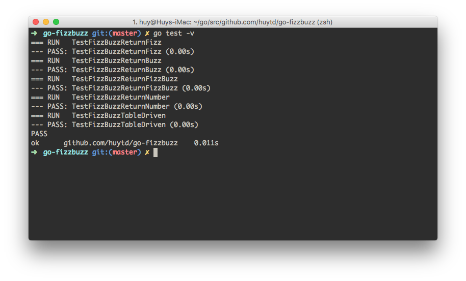
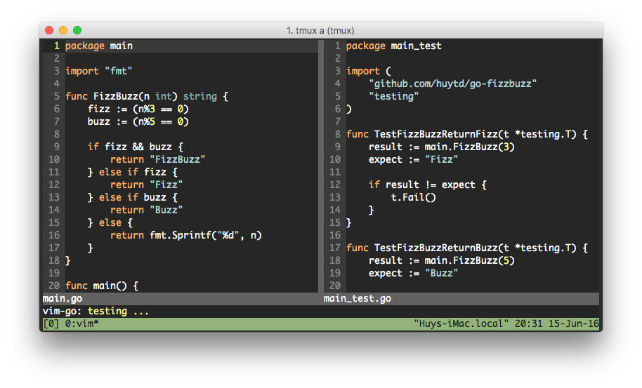
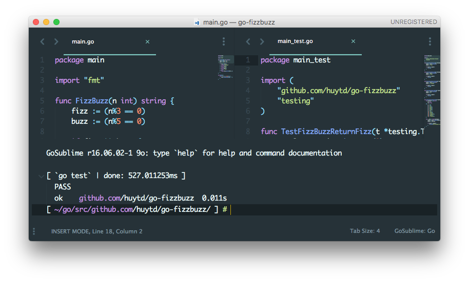
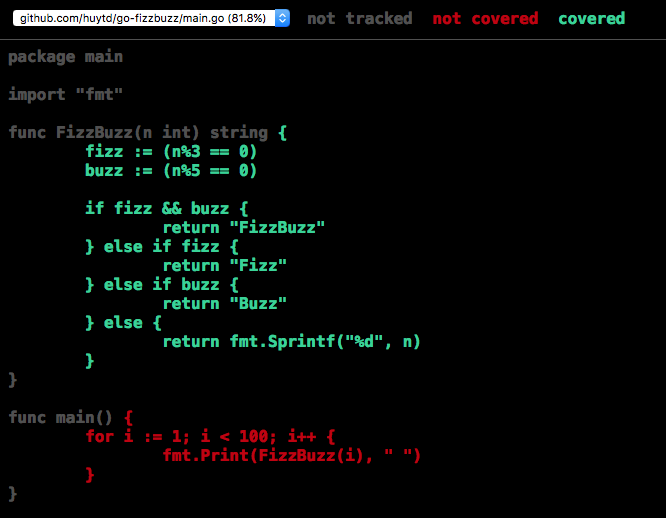

# go-fizzbuzz
:rabbit: Learn to write testable fizzbuzz program in Golang

## The program
**FizzBuzz** is a toy program that has very simple rules: You give **FizzBuzz** a number and it will:

- Return **Fizz** if that number is a multiples of **3**
- Return **Buzz** if that number is a multiples of **5**
- Return **FizzBuzz** if that number is both multiples of **3** and **5**
- Otherwise, return **the number itself** 

We will implement it as `FizzBuzz()` function in `main.go` and test it in `main_test.go()`

## Unit testing in Go

Go has a bunch of awesome built-in features, one of them is `go test`.

#### Write the tests
To write test for your code:

- Create a new `*_test.go` file, where `*` is the source file you want to test. In this example, it will be `main_test.go`.
- Write the test function with the name of `Test*(t *testing.T) { }`, where `*` is whatever meaningful describe you want.

#### Run the tests
To test them, open Terminal and run:

```bash
$ go test
```



If you are using editors like `vim`, install [vim-go](https://github.com/fatih/vim-go) plugin, then type: `:GoTest`. 



For `Sublime`, install the [official build system integration](https://github.com/golang/sublime-build), then run `Test` command in the `Command Pallete`.



#### Code Coverage
It's not a must, but it's recommeneded to run coverage to see how many percent of your code are not being tested yet.

To run coverage, open Terminal and run:

```bash
$ go test -cover
```

The output will tell you how much coverage your code is. For example:

```
PASS
coverage: 81.8% of statements
ok      github.com/huytd/go-fizzbuzz    0.421s
```

This output mean: the project is 81.8% coverage.

If this is not enough, Go also provide you a deeper look into your code, so you can see what lines of code are not tested. To do it, you need to tell Go to generate some output when it run coverage:

```bash
$ go test -coverprofile=cover.out
```

Then you can use the `cover` tool to read this output in HTML format:

```bash
$ go tool cover -html=cover.out
```



The green lines is the tested code, red lines is not tested yet.

## How to write test in Go?

Each `*_test.go` file will be called a **test suite**, where you put the related **test cases**.

Each **test case** will be a function, its name must begin with `Test...`, it takes the `t` object form `testing` package for some helpful features. Example:

```go
func TestGitHubDDoSFeature(t *testing.T) {
	// Write your test code here
}
```

In each test function, use `t.Error()` or `t.Fail()` to let Go know when your test failed.

Use `Fail()` when you just want your test fail, and does not print any message:

```go
func TestGitHubDDoSFeature(t *testing.T) {
	...
	t.Fail()
}
```

Use `Error()` to fail your test with some blame:

```go
func TestGitHubDDoSFeature(t *testing.T) {
	...
	t.Error("You know nothing, Jon Snow!")
}
```

Check the [Go Docs](https://golang.org/pkg/testing/#pkg-index) for more about `testing` package.

Next, we will discuss how to organizing test cases in each test suite.

#### The basic: Case by Case
<TBD>

#### Community recommended: Table Driven Test
<TBD>

## TDD or not TDD?
<TBD>

#### Write test first, the code can wait
<TBD>

#### Write code first, test it later
<TBD>

#### Changes are OK, and you can handle it
<TBD>

## How much coverage is enough?

This is an hard question, and the answer is depending on who you are, what you are working on, or even the language you are using (keep calm and read on)...

In this example, we're working on a function called `FizzBuzz()`, so we just test this function, the example code to use it in `main()` are not necessary to be tested, that's why we only get 81.8% coverage.

There are some good articles to read about code coverage:

- [Code coverage goal: 80% and no less!](http://googletesting.blogspot.com/2010/07/code-coverage-goal-80-and-no-less.html)
- [Measuring Coverage at Google](http://googletesting.blogspot.com/2014/07/measuring-coverage-at-google.html)